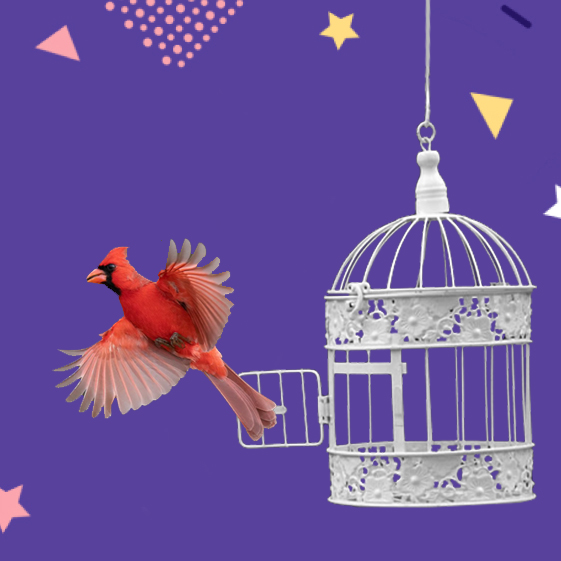

<div align="center">

  
  
  Diseño: https://www.figma.com/file/C2WufDbWmVbojtcGXFJfcI/Animals?node-id=23%3A2
  
  </div>

<br />

<!-- Table of Contents -->
# 💻 Table of Contents

- [About the Project](#about-the-project-⭐)
  * [Screenshots](#screenshots-📷)
  * [Tech Stack](#tech-stack-👾)
- [Getting Started](#getting-started-🧰)
  * [Run Locally](#run-locally-🏃‍♀️)
- [Authors](#authors-🙋‍♀️​)
- [Contributing](#contributing-👋 )
- [Contact](#contact-🤝)

  

<!-- About the Project -->
## About the Project ⭐ 
Virtual Zoo es una App que muestra una lista random de 10 animales que va cambiando al tocar el botón next o actualizar la página.


<!-- Screenshots -->
### Screenshots 📷


<!-- TechStack -->
### Tech Stack 👾 

- ReactJs (18.2.0)
- Styled Components (^5.3.5)
- Axios (1.0.0)
- React Router Dom (^6.3.0)

<!-- Getting Started -->
## 	Getting Started 🧰 

<!-- Run Locally -->
### Run Locally 🏃‍♀️ 

Clona el proyecto

```bash
  git clone https://github.com/mflamanna/Virtual-Zoo.git
```
Instala las dependencias

```bash
  npm i
```

Abre en el navegador

```bash
  npm start
```

## Author 🙋‍♀️​

 [Florencia Lamanna](https://github.com/mflamanna)


<!-- Contributing -->
## Contributing 👋 

Sugerencias y contribuciones son siempre bienvenidas!

Mira en el apartado de contacto para más información.


<!-- Contact -->
## Contact 🤝 

lamanna.mflorencia@gmail.com
